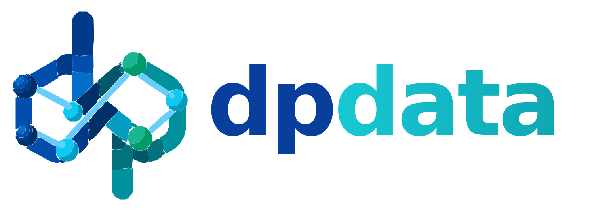
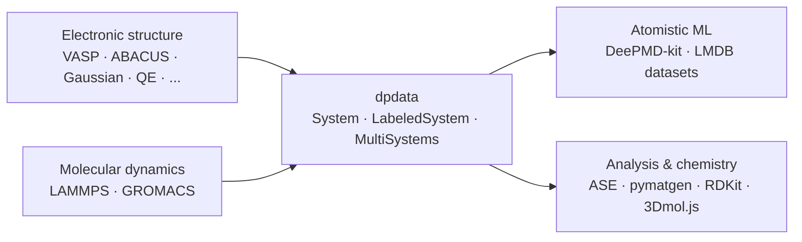

<p align="center">
  
</p>

# dpdata

**Turn atomistic simulation outputs into interoperable, machine-learning-ready datasets.**

[](https://doi.org/10.1021/acs.jcim.5c01767)
[](https://anaconda.org/conda-forge/dpdata)
[](https://pypi.org/project/dpdata)
[](https://dpdata.readthedocs.io/)
[](./LICENSE)

[**Documentation**][documentation] · [**Supported formats**][formats] ·
[**Quick start**](#-start-in-minutes) · [**Try online**][try-online] ·
[**Python API**][python-api] · [**Plugins**][plugins] · [**Paper**][paper]

> [!IMPORTANT]
> **One data model, many atomistic formats.**
> Load structures, trajectories, energies, forces, and virials from simulation
> codes, manipulate them through `System`, `LabeledSystem`, and `MultiSystems`,
> then export the data in the format your next tool expects.

dpdata connects electronic-structure codes, molecular-dynamics engines, and
atomistic machine-learning workflows. Use the command line for one-off
conversion, or the Python API to build reproducible data-processing pipelines
that preserve atomistic structures and labels.



## ⚡ Why dpdata

|     | Advantage                   | What it unlocks                                                                                                                       |
| --- | --------------------------- | ------------------------------------------------------------------------------------------------------------------------------------- |
| 🔄  | **Format interoperability** | Read and write formats used by electronic-structure, molecular-dynamics, atomistic-ML, and analysis tools through a common interface. |
| 🏷️  | **ML-ready labels**         | Keep coordinates, cells, atom types, energies, forces, virials, and registered extra fields together while converting data.           |
| 🧩  | **Heterogeneous datasets**  | Use `MultiSystems` to organize structures with different compositions and atom counts instead of forcing everything into one system.  |
| 💾  | **Dataset-scale storage**   | Export DeePMD NumPy layouts or a single LMDB database; LMDB can store frames with different compositions and atom counts.             |
| 🛠️  | **Structure operations**    | Select frames, build supercells, perturb structures, replace species, and compose data-processing workflows in Python.                |
| ⌨️  | **CLI and Python**          | Convert a file with one command, then move to the same format registry and data model when a workflow grows more complex.             |
| 🔌  | **Extensible by plugins**   | Add new formats as installable Python packages without modifying dpdata itself.                                                       |

## 🚀 Start in minutes

dpdata requires Python 3.10 or later. Install it from PyPI or conda-forge:

```bash
python -m pip install dpdata
# or: conda install -c conda-forge dpdata

dpdata --version
```

### Convert a file from the command line

Convert a VASP `OUTCAR` directly to a DeePMD NumPy dataset:

```bash
dpdata OUTCAR -i vasp/outcar -o deepmd/npy -O deepmd_data
```

See the complete [command-line reference][cli] for input/output options.

### Build a labeled dataset in Python

```python
import dpdata

# OUTCAR is recognized as a labeled VASP trajectory.
data = dpdata.LabeledSystem("OUTCAR")

# Keep selected frames and write a DeePMD NumPy dataset.
data.sub_system([0, -1]).to("deepmd/npy", "deepmd_data")
```

`LabeledSystem` keeps atomistic structures together with energies, forces, and
virials when they are available. See [`System` and `LabeledSystem`][systems] for
loading, data access, frame selection, replication, perturbation, and species
replacement.

### Combine many systems and scale out

```python
import dpdata

systems = dpdata.MultiSystems.from_dir(
    "./calculations",
    file_name="OUTCAR",
    fmt="vasp/outcar",
)
systems.to("deepmd/lmdb", "training.lmdb")
```

`MultiSystems` groups heterogeneous structures by composition, while the
`deepmd/lmdb` format stores frames from one or more systems in a single database.
For large DeePMD training sets, this provides a direct path from calculation
outputs to the DeePMD data loader. See [MultiSystems] and
[LMDB datasets][lmdb].

## 🧭 Pick the workflow you need

| Goal                                              | Start here                              |
| ------------------------------------------------- | --------------------------------------- |
| Convert one file between supported formats        | [Command-line interface][cli]           |
| Load structures or labeled trajectories in Python | [`System` and `LabeledSystem`][systems] |
| Organize many compositions or atom counts         | [`MultiSystems`][multisystems]          |
| Store heterogeneous DeePMD data in one database   | [DeepMD LMDB format][lmdb]              |
| See every registered input/output format          | [Supported formats][formats]            |
| Add support for a new format                      | [Plugin guide][plugins]                 |
| Experiment without installing locally             | [Try dpdata online][try-online]         |

## 🧱 Core data model

| Object          | Use it for                                                                                               |
| --------------- | -------------------------------------------------------------------------------------------------------- |
| `System`        | Structures and trajectories: atom types, coordinates, cells, and other non-label fields.                 |
| `LabeledSystem` | Reference data for atomistic ML: a `System` plus energies, forces, virials, and other registered labels. |
| `MultiSystems`  | Collections that contain multiple systems, compositions, or atom counts.                                 |

Specialized representations, including bond-order and mixed-type systems, are
documented under the [Systems guide][systems-index].

## 🔬 Scientific ecosystem

dpdata is designed to sit between the tools already used in computational
chemistry and materials science. Built-in formats include, among others:

- **Electronic structure and quantum chemistry:** VASP, ABACUS, Quantum
  ESPRESSO, Gaussian, CP2K, ORCA, FHI-aims, SIESTA, OpenMX, and DFTB+.
- **Molecular dynamics:** LAMMPS and GROMACS.
- **Atomistic ML and data:** DeePMD-kit formats, LMDB datasets, ASE, and
  pymatgen-compatible structures.
- **Chemistry and visualization:** RDKit and 3Dmol.js integrations.
- **Common interchange formats:** XYZ and other registered structure or
  trajectory formats.

The [supported-formats table][formats] is generated from dpdata's format
registry and is the source of truth for available readers and writers.

## 🧩 Plugins

The format registry can be extended by third-party packages through the
`dpdata.plugins` entry point. The repository includes a minimal
[`plugin_example/`](./plugin_example) showing the complete pattern.

One ecosystem plugin is [cp2kdata](https://github.com/robinzyb/cp2kdata), which
adds current CP2K support on top of dpdata. See the [plugin guide][plugins] to
build and distribute your own integration.

## 📚 Documentation and community

- Read the [full documentation][documentation].
- Browse [all supported formats][formats] before writing a converter yourself.
- Use [Try dpdata online][try-online] for a browser-based interactive example.
- Report bugs or request features in [GitHub Issues](https://github.com/deepmodeling/dpdata/issues).

## Citation

If dpdata contributes to published work, please cite:

Jinzhe Zeng, Xingliang Peng, Yong-Bin Zhuang, Haidi Wang, Fengbo Yuan, Duo
Zhang, Renxi Liu, Yingze Wang, Ping Tuo, Yuzhi Zhang, Yixiao Chen, Yifan Li,
Cao Thang Nguyen, Jiameng Huang, Anyang Peng, Marián Rynik, Wei-Hong Xu,
Zezhong Zhang, Xu-Yuan Zhou, Tao Chen, Jiahao Fan, Wanrun Jiang, Bowen Li,
Denan Li, Haoxi Li, Wenshuo Liang, Ruihao Liao, Liping Liu, Chenxing Luo,
Logan Ward, Kaiwei Wan, Junjie Wang, Pan Xiang, Chengqian Zhang, Jinchao
Zhang, Rui Zhou, Jia-Xin Zhu, Linfeng Zhang, and Han Wang. “dpdata: A Scalable
Python Toolkit for Atomistic Machine Learning Data Sets.” *Journal of Chemical
Information and Modeling* **65** (21), 11497–11504 (2025). DOI:
[10.1021/acs.jcim.5c01767][paper].
[](https://badge.dimensions.ai/details/doi/10.1021/acs.jcim.5c01767)

[cli]: https://docs.deepmodeling.com/projects/dpdata/en/master/cli.html
[documentation]: https://docs.deepmodeling.com/projects/dpdata/
[formats]: https://docs.deepmodeling.com/projects/dpdata/en/master/formats.html
[lmdb]: https://docs.deepmodeling.com/projects/dpdata/en/master/systems/lmdb.html
[multisystems]: https://docs.deepmodeling.com/projects/dpdata/en/master/systems/multi.html
[paper]: https://doi.org/10.1021/acs.jcim.5c01767
[plugins]: https://docs.deepmodeling.com/projects/dpdata/en/master/plugin.html
[python-api]: https://docs.deepmodeling.com/projects/dpdata/en/master/api/api.html
[systems]: https://docs.deepmodeling.com/projects/dpdata/en/master/systems/system.html
[systems-index]: https://docs.deepmodeling.com/projects/dpdata/en/master/systems/index.html
[try-online]: https://docs.deepmodeling.com/projects/dpdata/en/master/try_dpdata.html
